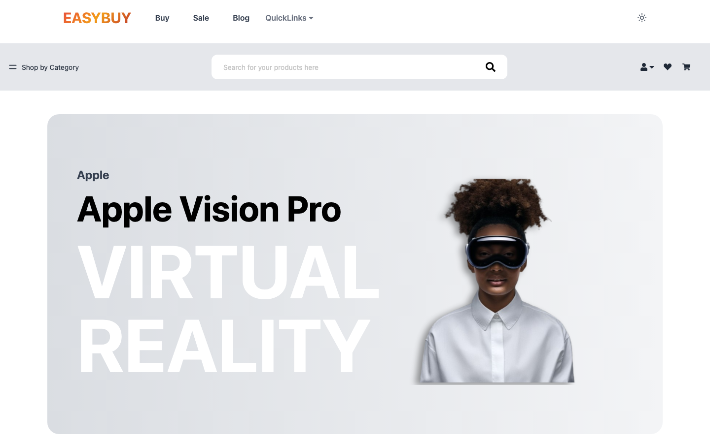
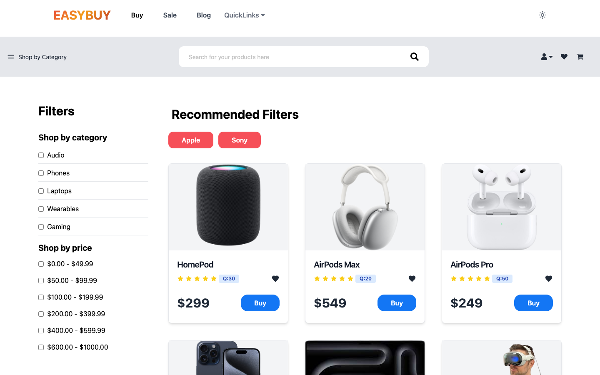
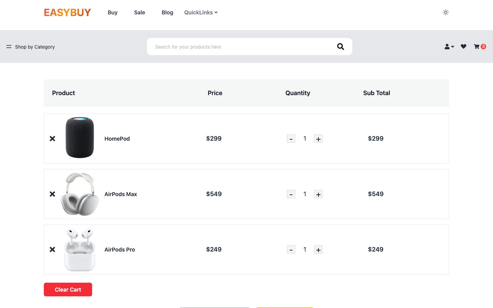
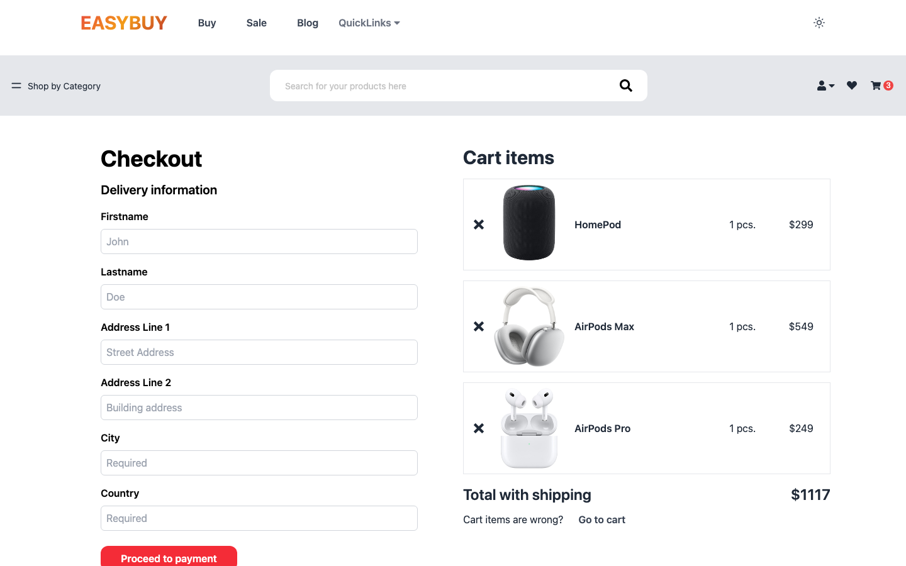
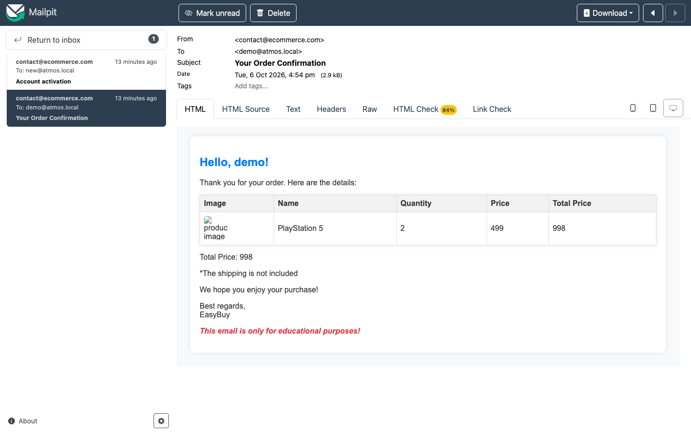
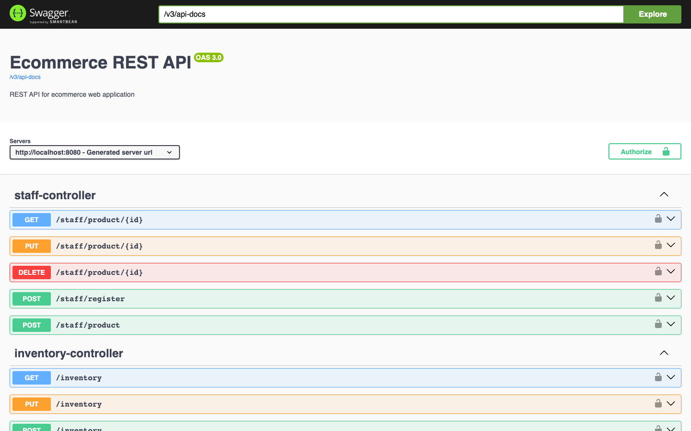
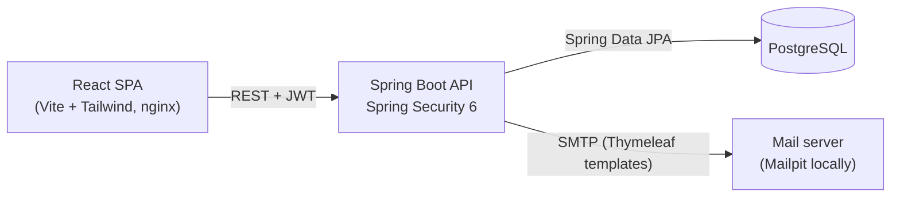

# EasyBuy — Full-Stack E-commerce Platform

A full-stack e-commerce application with a **Spring Boot 3 / Spring Security 6** REST API, a **React + Tailwind** storefront and **PostgreSQL**, with JWT authentication, role-based access control, inventory tracking and transactional email.

The whole stack (database, API, storefront and a local mail inbox) starts with one command.



## Quick start

**Prerequisite:** [Docker](https://docs.docker.com/get-docker/) with Compose v2.

```bash
git clone https://github.com/ishanshrestha14/Atmosfinal.git
cd Atmosfinal
docker compose up --build
```

The first build takes a few minutes. When the containers report healthy, open:

| Service | URL | Notes |
|---|---|---|
| Storefront | http://localhost:3000 | React app served by nginx |
| REST API | http://localhost:8080 | Spring Boot |
| API docs | http://localhost:8080/swagger-ui/index.html | Interactive OpenAPI / Swagger UI |
| Mail inbox | http://localhost:8025 | [Mailpit](https://mailpit.axllent.org/) catches every email the app sends |
| PostgreSQL | `localhost:5432` | db / user / password: `ecommerce` |

The database is seeded with categories, products, stock levels and two ready-to-use accounts:

| Role | Username | Password |
|---|---|---|
| Customer | `demo` | `Demo1234!` |
| Staff | `staff` | `Staff1234!` |

To try the full sign-up flow, register a new account. The 5-digit activation code arrives in the Mailpit inbox.

Stop the stack with `docker compose down`. Add `-v` to wipe the database and re-seed it on the next start.

## Screenshots

| Product catalogue with filters | Cart |
|---|---|
|  |  |
| **Checkout** | **Order confirmation email** |
|  |  |

**Interactive API documentation**



## Architecture



The backend is organised **by feature** rather than by layer (`auth`, `product`, `order`, `inventory`, `address`, `staff`…), with each package containing its own controller, service, repository and DTOs. Cross-cutting concerns live in dedicated packages:

- `security`: stateless JWT filter chain with access and refresh tokens
- `handler`: global exception handler that maps domain exceptions to HTTP responses
- `logging`: AOP aspect that audit-logs controller and service calls via custom annotations
- `email`: Thymeleaf-templated HTML emails for account activation and order confirmation

## Features

- **Authentication:** registration with server-side validation, emailed activation codes, JWT access and refresh tokens, password change
- **Role-based access control:** `CUSTOMER` and `STAFF` roles enforced by Spring Security
- **Catalogue:** products grouped by category and brand, with client-side search plus category and price filters
- **Cart and wishlist:** add and remove items, change quantities, clear the cart
- **Orders:** checkout with a saved delivery address; stock is decremented in the same transaction and an HTML confirmation email is sent
- **Staff tools:** create, update and delete products; manage inventory levels
- **Audit logging:** AOP-based method-level logging of controller and service calls
- **Dark mode:** in the storefront

## Tech stack

| Layer | Technologies |
|---|---|
| Backend | Java 17, Spring Boot 3, Spring Security 6, Spring Data JPA / Hibernate, Bean Validation, Spring AOP, Thymeleaf, springdoc-openapi |
| Auth | JWT (jjwt), BCrypt |
| Frontend | React 18, Vite, Tailwind CSS, React Router, React Hook Form, Axios, Framer Motion |
| Data | PostgreSQL 16 |
| Infrastructure | Docker (multi-stage builds), Docker Compose, nginx, Mailpit |

## Running without Docker

Requires JDK 17 and Node 20+. Start only the infrastructure in Docker and run the apps on the host for hot reload:

```bash
docker compose up -d db mail

# API: http://localhost:8080 (application.properties defaults match Compose)
cd server && ./mvnw spring-boot:run

# Storefront: http://localhost:5173
cd client && npm install && npm run dev
```

## Configuration

Every setting has a local default, so nothing needs to be configured to run the project. To override a value, copy [`.env.example`](.env.example) to `.env`. The most important variables are:

| Variable | Purpose | Default |
|---|---|---|
| `PGHOST`, `PGPORT`, `PGDATABASE`, `PGUSER`, `PGPASSWORD` | PostgreSQL connection | `localhost:5432/ecommerce` |
| `JWT_SECRET_KEY` | Base64 HMAC key for signing JWTs (`openssl rand -base64 32`) | development-only key |
| `CORS_ALLOWED_ORIGINS` | Comma-separated list of allowed frontend origins | `http://localhost:3000,http://localhost:5173` |
| `EMAIL_HOST`, `EMAIL_PORT`, `EMAIL_SENDER`, `EMAIL_SENDER_PASSWORD` | SMTP settings (set `EMAIL_SMTP_AUTH=true` and `EMAIL_STARTTLS=true` for a real provider) | Mailpit |
| `FLYWAY_LOCATIONS` | Migration locations; drop `classpath:db/seed` in production to skip demo data | `classpath:db/migration,classpath:db/seed` |
| `VITE_API_BASE_URL` | API URL baked into the frontend build | `http://localhost:8080` |

## API overview

Full, interactive documentation is available at `/swagger-ui/index.html` while the API is running.

### Authentication

| Method | Endpoint | Description |
|--------|----------|-------------|
| POST   | /register | Register a new customer and send an activation email |
| POST   | /login    | Authenticate and receive access and refresh tokens |
| POST   | /refresh-token | Exchange a refresh token for a new access token |
| GET    | /activate-account | Activate an account with the emailed code |
| GET    | /me       | Get the current user |
| PATCH  | /change-password | Change the password (requires re-activation by email) |

### Catalogue

| Method | Endpoint | Description |
|--------|----------|-------------|
| GET    | /products | List all products, including category and stock |
| GET    | /categories | List all categories |

### Staff (`STAFF` role)

| Method | Endpoint | Description |
|--------|----------|-------------|
| POST   | /staff/register | Register a staff member |
| POST   | /staff/product | Create a product |
| GET / PUT / DELETE | /staff/product/{id} | Read, update or delete a product |

### Inventory

| Method | Endpoint | Description |
|--------|----------|-------------|
| GET    | /inventory | List stock levels |
| GET    | /inventory/{productId} | Get stock for one product |
| POST   | /inventory | Create a stock record for a product |
| PUT    | /inventory | Bulk-update stock levels |

### Delivery addresses

| Method | Endpoint | Description |
|--------|----------|-------------|
| GET    | /delivery | List the current user's addresses |
| POST   | /delivery | Add an address |
| PUT    | /delivery/{addressId} | Update an address |
| DELETE | /delivery/{addressId} | Delete an address |

### Orders

| Method | Endpoint | Description |
|--------|----------|-------------|
| GET    | /order/all | List the current user's orders |
| GET    | /order/{orderId} | Get one order |
| POST   | /order/{addressId} | Place an order (decrements stock and emails a confirmation) |
| DELETE | /order/{orderId} | Delete an order |

## Domain model

| Use cases | Entity relationships |
|---|---|
|  |  |

## Roadmap

Active work on this project, tracked as individual pull requests:

- [x] One-command local environment with Docker Compose, seed data and a local mail inbox
- [ ] Automated test suite: unit tests, `@WebMvcTest` security tests, and Testcontainers integration tests against real PostgreSQL
- [ ] Concurrency-safe stock reservation (optimistic locking) with a multi-threaded overselling test
- [ ] Ownership checks on orders and addresses; tighter authorisation on inventory endpoints
- [ ] Send email after the transaction commits (transactional events or an outbox)
- [ ] `BigDecimal` money handling, with the price recorded on each order line at purchase time
- [ ] RFC 7807 `ProblemDetail` error responses
- [x] Flyway schema migrations to replace `ddl-auto`
- [ ] GitHub Actions CI and a public cloud deployment
